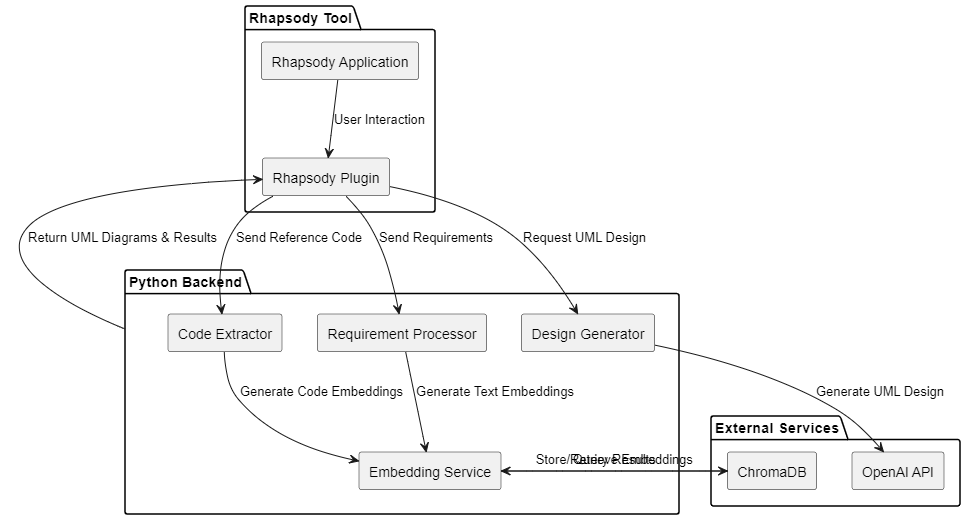
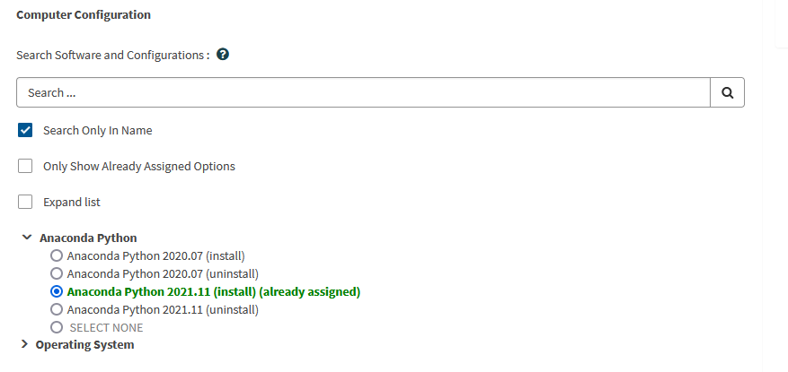

# Rhapsody plugin for GenAI

This Project demonstrates the plugin for Rhapsody that can offer Generative AI Support.

# Plugin Architechture



# Python Environment Setup for Windows
Step1: 
install Anaconda Distribution for Windows from ITSP:
https://service-management.bosch.tech/sp?id=sc_cat_item&sys_id=b08ed16c1b83c91078087403dd4bcbb1

Step2:
Activate your Conda to enable python:
```
Conda list <command to list your conda environments>
conda create --name <command to create your own conda env>
conda activate <your env / base>
```
Step3
create a python virtual Environment (local to your project)
```
python -m venv myvenv
```
Step2:
Activate your Virtual Environment:
```
./myvenv/Scripts/activate
```
Step4:
install the pip packages available as listed in the requirements.txt
```
pip install -r requirements.txt
```
Step4 (optional: only if you are using Jupyter notebook):
create a new Jupyter kernel to run your jupyter notebook.
```
python3 -m ipykernel install --user --name=<your_env_name>
```
Step5 (optional: only if you are using Jupyter notebook):
Select the newly created kernel in your notebook and run.

# Steps for JAVA Setup in Linux (for Rhapsody plugin Compilation), and Rhapsody Pluggin Execution.
Step1:
Copy the rhapsody.jar file located in your Rhapsody installation folder in windows:
```
C:/Program Files/IBM/Rhapsody/Share/JavaAPI
```
and paste it in 
```
rhapsody-plugin/lib/<your rhapsody.jar file>
```
Step2:
in Linux install Java Development Kit.
Install the same version of JDK that you plan to use on Windows (e.g., JDK 11).
```
sudo apt install openjdk-11-jdk
```
Step3:
Install Maven
(Required to build the plugin)
```
sudo apt install maven
```
Step4:
Install the following extensions in VSCode:
```
Java Extension Pack (for Java development).
Maven for Java (for Maven integration).
```
Step5:
Run the following command to build the plugin
```
cd rhapsody-plugin/
mvn clean install
```
The resulting JAR file will be in the target/ directory.

Step6:
Transfer to Windows:
Transfer the compiled JAR file (e.g., rhapsody-plugin-1.0-SNAPSHOT.jar) to the Windows machine.Place the JAR file in the Rhapsody plugins directory 
```
(e.g., C:\Program Files\IBM\Rhapsody\Plugins). 
```
Update the Rhapsody configuration to load the plugin. Open rhapsody.ini (usually located in the Rhapsody installation directory). Add the plugin JAR file to the AddIns section.
```
AddIns=rhapsody-plugin-1.0-SNAPSHOT.jar
```
Step7:
Start the python Backend
```
python <your_python_file.py>
```
ensure the backend starts without errors and listens on the expected port (e.g., http://localhost:5000).

Step8: Verify Backend Endpoints:
Use tools like Postman, cURL, or a Browser to test the backend endpoints.
```
curl -X POST http://localhost:5000/summarize_requirements -H "Content-Type: application/json" -d '{"feature_query": "Extract requirements related to a <feature>"}'
```


# Testing the Python Backend and Rhapsody Plugin

This document provides guidance on how to individually test the Python backend and the Rhapsody plugin, as well as perform integration testing.

---

## 1. Testing the Python Backend

### A. Run the Python Backend

1. **Ensure Dependencies Are Installed:**
   - Install all required Python dependencies using `requirements.txt`:
     ```bash
     pip install -r requirements.txt
     ```

2. **Start the Backend Server:**
   - Run the Python backend script (e.g., `openai.py` or `backend.py`):
     ```bash
     python openai.py
     ```
   - Ensure the backend starts without errors and listens on the expected port (e.g., `http://localhost:5000`).

3. **Verify Backend Endpoints:**
   - Use tools like **Postman**, **cURL**, or a browser to test the backend endpoints.
   - Example using `cURL`:
     ```bash
     curl -X POST http://localhost:5000/create_uml_design -H "Content-Type: application/json" -d '{"feature_query": "Create a login system", "uml_type": "Sequence Diagram"}'
     ```
   - Verify the response from the backend (e.g., UML diagram data or error messages).

4. **Debugging:**
   - Add logging to the backend to track requests and responses:
     ```python
     from flask import Flask, request
     import logging

     app = Flask(__name__)
     logging.basicConfig(level=logging.DEBUG)

     @app.route('/create_uml_design', methods=['POST'])
     def create_uml_design():
         logging.debug(f"Request data: {request.json}")
         # Your logic here
         return {"status": "success"}
     ```

5. **Test Locally Hosted Models (Ollama):**
   - If the backend interacts with locally hosted models via Ollama, ensure the models are running and accessible.
   - Example:
     ```bash
     ollama serve
     ```
   - Test the backend's ability to query the models.

---

### B. Automate Backend Testing

1. **Write Unit Tests:**
   - Use Python's `unittest` or `pytest` to write tests for individual backend functions.
   - Example:
     ```python
     import unittest
     from openai import calculate_pdf_hash

     class TestBackend(unittest.TestCase):
         def test_calculate_pdf_hash(self):
             result = calculate_pdf_hash("sample.pdf")
             self.assertEqual(result, "expected_hash")

     if __name__ == "__main__":
         unittest.main()
     ```

2. **Test API Endpoints:**
   - Use `pytest` with the `Flask` test client to test API endpoints.
   - Example:
     ```python
     from flask import Flask
     import pytest

     @pytest.fixture
     def client():
         app = Flask(__name__)
         app.testing = True
         return app.test_client()

     def test_create_uml_design(client):
         response = client.post('/create_uml_design', json={"feature_query": "Login system"})
         assert response.status_code == 200
     ```

---

## 2. Testing the Rhapsody Plugin

### A. Test the Plugin Code Independently

1. **Mock Rhapsody Environment:**
   - Since the plugin interacts with the Rhapsody API, you can mock the `IRPApplication` and other Rhapsody-specific classes to test the plugin logic independently.
   - Example:
     ```java
     public class MockRhapsodyApp implements IRPApplication {
         @Override
         public void writeToOutputWindow(String title, String message) {
             System.out.println("[" + title + "] " + message);
         }
         // Implement other methods as needed
     }

     public static void main(String[] args) {
         MockRhapsodyApp mockApp = new MockRhapsodyApp();
         GenAIPlugin plugin = new GenAIPlugin();
         plugin.setRhapsodyApp(mockApp); // Add a setter for testing
         plugin.init();
     }
     ```

2. **Test Backend Communication:**
   - Test the plugin's ability to send HTTP requests to the backend and handle responses.
   - Example:
     ```java
     public void testBackendCommunication() {
         try {
             String response = sendRequirementToBackend("Test requirement");
             System.out.println("Backend Response: " + response);
         } catch (Exception e) {
             e.printStackTrace();
         }
     }
     ```

3. **Run the Plugin in a Standalone Java Application:**
   - Create a standalone Java application to test the plugin logic without Rhapsody.
   - Example:
     ```java
     public static void main(String[] args) {
         GenAIPlugin plugin = new GenAIPlugin();
         plugin.init();
         plugin.generateUMLDesign();
     }
     ```

---

### B. Test the Plugin in Rhapsody

1. **Build the Plugin:**
   - Use Maven to build the plugin:
     ```bash
     mvn clean install
     ```
   - Copy the resulting JAR file (e.g., [rhapsody-plugin-1.0-SNAPSHOT.jar](http://_vscodecontentref_/0)) to the Rhapsody plugins directory.

2. **Load the Plugin in Rhapsody:**
   - Update the `rhapsody.ini` file to include the plugin JAR file:
     ```
     AddIns=rhapsody-plugin-1.0-SNAPSHOT.jar
     ```

3. **Test Plugin Functionality:**
   - Start Rhapsody and verify the plugin is loaded.
   - Test the plugin's features (e.g., generating UML diagrams, communicating with the backend).

4. **Debugging:**
   - Use `rhapsodyApp.writeToOutputWindow()` to log messages to the Rhapsody output window for debugging.
   - Example:
     ```java
     rhapsodyApp.writeToOutputWindow("GenAIPlugin", "Testing backend communication...");
     ```

---

### C. Automate Plugin Testing

1. **Write Unit Tests for Plugin Logic:**
   - Use a Java testing framework like JUnit to test individual methods in the plugin.
   - Example:
     ```java
     @Test
     public void testSendRequirementToBackend() {
         GenAIPlugin plugin = new GenAIPlugin();
         String response = plugin.sendRequirementToBackend("Test requirement");
         assertNotNull(response);
     }
     ```

2. **Mock Backend Responses:**
   - Use a mocking library like Mockito to simulate backend responses.
   - Example:
     ```java
     @Test
     public void testBackendCommunication() {
         HttpURLConnection mockConnection = Mockito.mock(HttpURLConnection.class);
         Mockito.when(mockConnection.getResponseCode()).thenReturn(HttpURLConnection.HTTP_OK);
         // Test plugin logic with the mocked connection
     }
     ```

---

## 3. Integration Testing

Once both the backend and plugin are tested individually, perform integration testing to ensure they work together seamlessly.

### Steps:

1. Start the Python backend on the target system.
2. Load the plugin in Rhapsody.
3. Test end-to-end functionality (e.g., sending a requirement from the plugin to the backend and receiving a UML diagram).
4. Verify logs and outputs in both the plugin and backend.

---

By following this guide, you can ensure both the Python backend and Rhapsody plugin are thoroughly tested individually and as an integrated system.