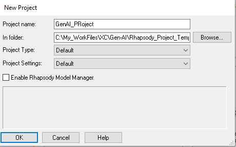
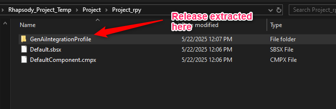
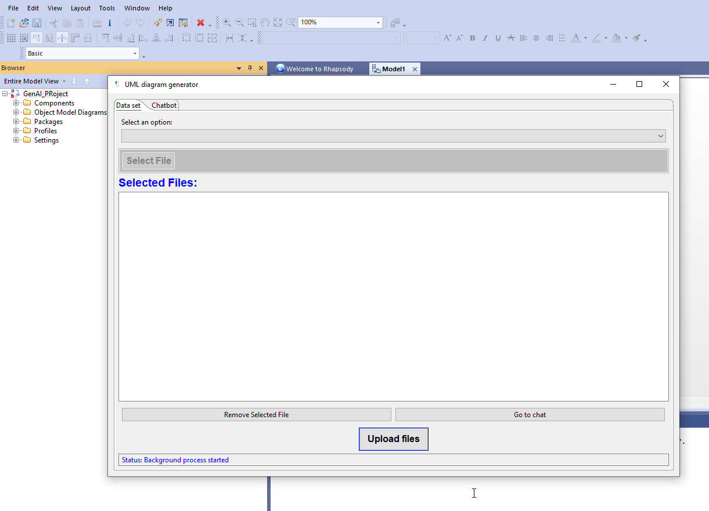

# Rhapsody plugin for GenAI

This Project demonstrates the plugin for Rhapsody that can offer Generative AI Support via a python Backend.

# Plugin Architechture


# Python Environment Setup for Windows
Step1: first setup your proxy by following the below link:
https://inside-docupedia.bosch.com/confluence/display/DEVCORNER/Px

Step2: Subscribe to the OPENAI AZURE Instance as below:
https://rb-xorder.bosch.com/o/xplatform-services/get-access-to-azure-openai. 

OpenAI Instance Link: "MS-EPB1-XC OpenAI Instance"

Step3: execute the provided bat script.
```
.\python_setup.bat
```
This script will install python and it will ask for OPENAI_API_KEY. Pass the OPENAI_API_KEY you had obtained from the step2. 


# Configuration in Rhapsody:
Step1: Create a New Rhapsody project or open an Existing Rhapsody Project.
<div align="left">
  
</div>

Step2: Once you create this new project, in the File Explorer go to the path of your project. Within your project folder you will notice a folder with name: "<Project_name>_rpy" being created. Now download our Release and extract the contents within the above created folder.
<div align="left">
  
</div>

Step3: Now you need to configure your project. For the created / available project go to file > Add to Model
<div align="left">
  
</div>

This will ask to load .sbsx file. This file will be available from our release. Go to the release Download folder and select the "GenAiIntegrationProfile.sbsx" file. After selection you can see the Rhapsody plugin for GenAI being enabled. 
<div align="left">
  
</div>

Now you can see your plugin working:
<div align="left">
  
</div>

Cheers!!
Now you can feed in your Documents and start Chatting with your Documents. 

<div align="left">
  
</div>